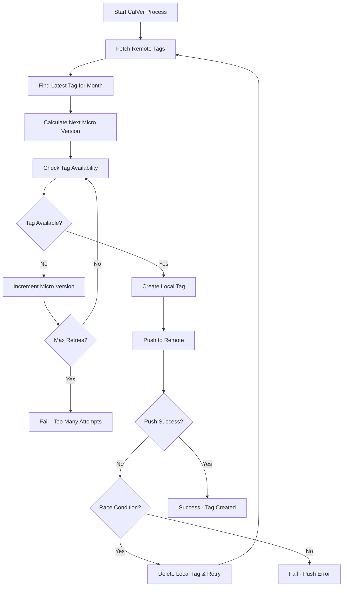

# CalVer Tag Conflict Resolution Guide

## Overview

This document explains the CalVer tag conflict resolution strategy implemented in the CI/CD pipeline to handle the error: "Updates were rejected because the tag already exists in the remote."

## Problem Description

### Error Scenario

The pipeline fails with errors like:

```
fatal: Updates were rejected because the tag already exists in the remote
error: failed to push some refs to 'https://github.com/bbapp-grp/admin-ui.git'
```

### Root Causes

1. **Race Conditions**: Multiple builds running simultaneously
2. **Build Retries**: Failed builds retry with the same tag
3. **Manual Tag Creation**: Developers manually create conflicting tags
4. **Incomplete Cleanup**: Previous failed builds leave orphaned tags

## Enhanced CalVer Strategy

### CalVer Format

- **Format**: `YY.MM.MICRO` (e.g., `25.06.1`, `25.06.2`)
- **Incremental**: Micro version increments for each release in a month
- **Automatic**: Generated based on existing tags

### Conflict Resolution Features

#### 1. Robust Tag Discovery

```bash
# Fetches remote tags and finds latest for current month
git fetch --tags --force origin
latest_tag=$(git tag -l "${current_year_month}.*" | \
             grep -E "^${current_year_month}\.[0-9]+$" | \
             sort -V | tail -1)
```

#### 2. Availability Checking

- **Local Check**: Verifies tag doesn't exist locally
- **Remote Check**: Confirms tag doesn't exist on origin
- **Double Verification**: Checks again before pushing

#### 3. Retry Logic with Increment

```bash
max_retries=10
while [[ $retry_count -lt $max_retries ]]; do
    candidate_tag="${current_year_month}.${new_micro}"

    # Check availability
    if tag_is_available "$candidate_tag"; then
        break
    fi

    # Increment and retry
    new_micro=$((new_micro + 1))
    retry_count=$((retry_count + 1))
done
```

#### 4. Atomic Tag Operations

- **Create Locally**: Create tag locally first
- **Push Atomically**: Push with conflict detection
- **Cleanup on Failure**: Remove local tag if push fails
- **Race Detection**: Detect if another process created the same tag

### Implementation Flow



## Usage in CI/CD Pipeline

### GitHub Actions Integration

The enhanced script integrates seamlessly with GitHub Actions:

```yaml
- name: Create CalVer Tag
  id: calver
  run: |
    ./scripts/create-calver-tag.sh

- name: Use Generated Tag
  run: |
    echo "Generated tag: ${{ steps.calver.outputs.calver_tag }}"
    echo "Version tag: ${{ steps.calver.outputs.version_tag }}"
```

### Reusable Workflow Update

The `release-build.yml` workflow should incorporate this logic:

```yaml
- name: Generate CalVer Tag
  id: calver
  run: |
    # Enhanced CalVer generation with conflict resolution
    if ! ./build-and-push.sh calver; then
      echo "::error::CalVer tag generation failed"
      exit 1
    fi
```

## Error Handling Scenarios

### Scenario 1: Concurrent Builds

**Problem**: Two builds start simultaneously for the same month
**Resolution**:

- First build gets `25.06.1`
- Second build detects conflict and gets `25.06.2`
- Both succeed with different tags

### Scenario 2: Build Retry

**Problem**: Build fails and is retried, tries to create same tag
**Resolution**:

- Retry detects existing tag `25.06.1`
- Automatically increments to `25.06.2`
- Build succeeds with new tag

### Scenario 3: Manual Tag Creation

**Problem**: Developer manually creates `25.06.1`, build conflicts
**Resolution**:

- Build detects existing tag
- Automatically skips to `25.06.2`
- No manual intervention required

### Scenario 4: Network Issues

**Problem**: Temporary network issues during tag push
**Resolution**:

- Retry mechanism with exponential backoff
- Validates tag state before each retry
- Cleans up failed local tags

## Monitoring and Debugging

### Log Output Example

```
[INFO] Starting enhanced CalVer tag creation process
[INFO] Generating CalVer tag for period: 25.06
[INFO] Fetching latest remote tags...
[INFO] Found latest tag for 25.06: 25.06.3 (micro: 3)
[INFO] Checking if tag '25.06.4' is available (attempt 1/10)
[SUCCESS] Tag '25.06.4' is available
[INFO] Creating and pushing tag: 25.06.4
[SUCCESS] Created local tag: 25.06.4
[INFO] Pushing tag to remote (attempt 1/3)...
[SUCCESS] Successfully pushed tag: 25.06.4
[SUCCESS] CalVer tag process completed successfully: 25.06.4
```

### Warning Indicators

- **Multiple Retries**: Indicates high concurrency or manual tags
- **Race Conditions**: Shows timing conflicts between builds
- **Max Retries Reached**: Suggests systematic issues

## Best Practices

### For Developers

1. **Avoid Manual Tags**: Let the CI/CD system manage CalVer tags
2. **Use Semantic Tags**: Create semantic tags like `feature-v1.2` for manual tagging
3. **Check Pipeline Status**: Ensure previous builds complete before pushing

### For Operations

1. **Monitor Retry Patterns**: High retry counts indicate issues
2. **Clean Orphaned Tags**: Regularly clean up failed/orphaned tags
3. **Capacity Planning**: Scale build infrastructure for peak times

### For Repository Admins

1. **Protected Tags**: Consider protecting CalVer tag patterns
2. **Branch Protection**: Ensure only CI/CD can push to main
3. **Audit Trail**: Monitor who creates manual tags

## Migration Strategy

### Step 1: Update Build Script

Replace the existing CalVer logic in `build-and-push.sh` with the enhanced version.

### Step 2: Update Workflows

Modify GitHub Actions workflows to use the enhanced script:

```yaml
# Before
- name: Create tag
  run: git tag v25.06.1 && git push origin v25.06.1

# After
- name: Create CalVer tag with conflict resolution
  run: ./build-and-push.sh calver
```

### Step 3: Test in Development

1. Create test scenarios with conflicting tags
2. Verify retry and increment logic
3. Validate error handling

### Step 4: Deploy to Production

1. Update main branch workflow
2. Monitor first few releases
3. Verify no tag conflicts occur

## Migration and Testing Tools

### Migration Script

Use `scripts/migrate-calver.sh` to migrate other microservices to the enhanced CalVer system:

```bash
# Run the migration checker
./scripts/migrate-calver.sh

# Follow the provided migration steps
# Copy the enhanced CalVer script to other repositories
# Update build scripts and workflows
```

### Test Suite

Validate the CalVer implementation using the comprehensive test suite:

```bash
# Run all CalVer tests
./scripts/test-calver.sh

# The test suite validates:
# - Basic CalVer format generation
# - Conflict detection and resolution
# - Concurrent tag creation scenarios
# - Build script integration
# - Error handling
# - Documentation completeness
```

**Note**: The test script creates temporary tags with the `test-calver` prefix, which are automatically cleaned up after testing.

---

## Troubleshooting

### Common Issues

#### Issue: "Max retries reached"

**Cause**: Too many existing tags for the current month
**Solution**:

- Check for manually created tags
- Verify tag cleanup procedures
- Consider monthly tag limit policies

#### Issue: "Race condition detected"

**Cause**: Multiple builds running simultaneously  
**Solution**:

- Increase retry delays
- Implement build queuing
- Scale build infrastructure

#### Issue: "Failed to fetch tags"

**Cause**: Network connectivity issues
**Solution**:

- Verify git credentials
- Check network connectivity
- Implement retry logic for git fetch

### Recovery Procedures

#### If Pipeline Still Fails

1. **Manual Tag Creation**: Create the next available tag manually
2. **Tag Cleanup**: Remove conflicting tags if safe
3. **Build Restart**: Restart the build with clean state

#### If Tag Sequence Breaks

1. **Audit Tags**: List all tags for the month
2. **Identify Gaps**: Find missing or duplicate tags
3. **Manual Correction**: Create missing tags or remove duplicates

## Conclusion

The enhanced CalVer tag resolution system provides:

- **Automatic Conflict Resolution**: No manual intervention needed
- **Race Condition Handling**: Safe concurrent builds
- **Robust Error Recovery**: Graceful handling of edge cases
- **Comprehensive Logging**: Clear visibility into tag creation process

This system ensures reliable CalVer tag creation while maintaining the integrity of the versioning strategy across all microservices in the BBApp ecosystem.
